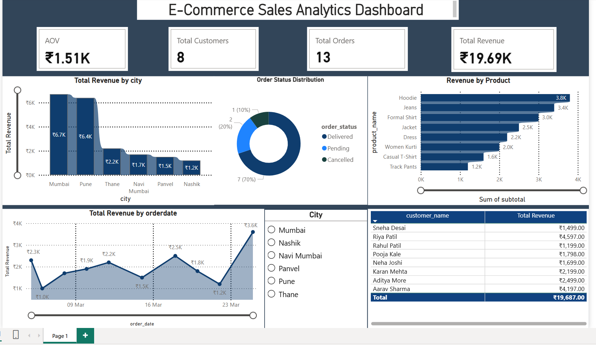
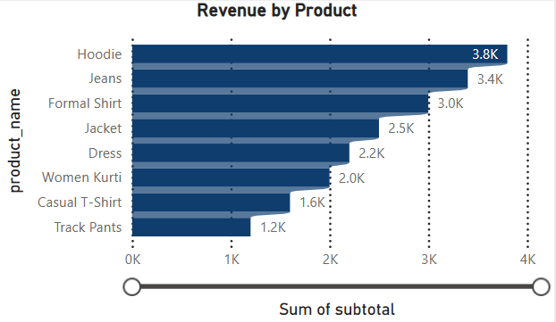
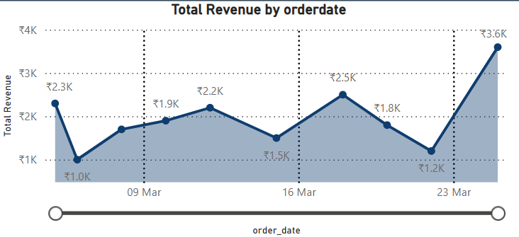

# E-Commerce Sales Analytics Dashboard

Interactive Business Intelligence dashboard developed using Power BI and MySQL for analyzing sales, revenue, customer behavior, and product performance.

## Tools Used
- Power BI
- MySQL
- SQL

## Dashboard Features
- Revenue Analysis
- Product Performance Tracking
- Order Status Distribution
- City-wise Revenue Analysis
- Customer Revenue Insights
- Sales Trend Analysis
- KPI Metrics Dashboard

## Screenshots

### Dashboard Overview

### KPI Cards

### Product Analysis

### Sales Trend
